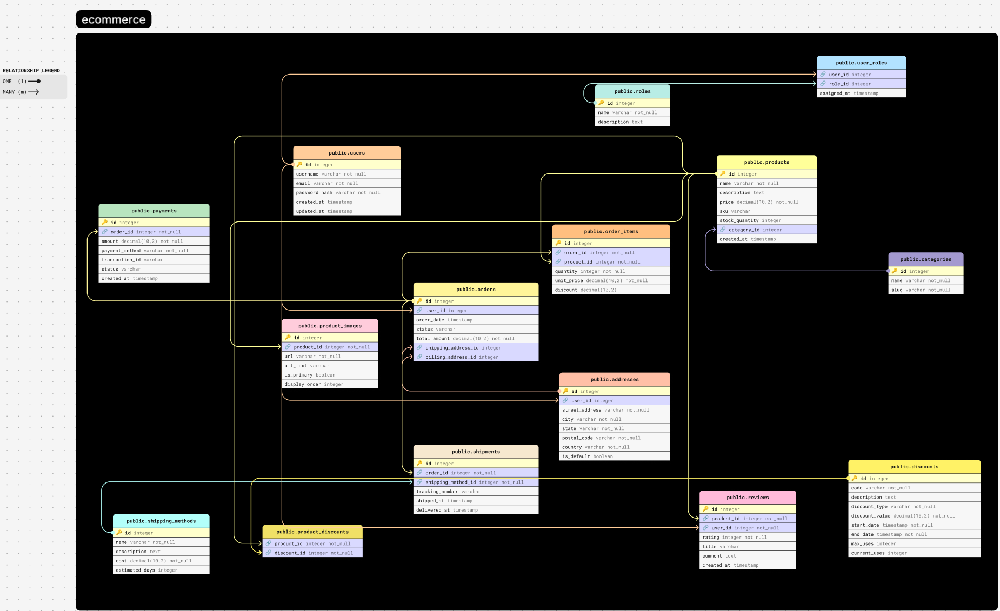

# 🧩 FigJam ERD Plugin

Easily create interactive **Entity Relationship Diagrams (ERDs)** in [FigJam](https://www.figma.com/figjam/) with this plugin. Just paste your database schema written in **MySQL**, **PostgreSQL**, or **DBML**, and the plugin will parse it into an editable diagram with tables and relationships.



---

## ✨ Features

- 📝 **Built-in Code Editor** with live preview and syntax highlighting
- 🔍 **Real-Time Error Detection** for supported SQL dialects
- 📊 **Auto-Generated Diagrams** from MySQL, PostgreSQL, and DBML
- 🧱 **Visual Elements**:
  - Primary/Foreign key icons
  - Color-coded fields by type
- 🖱️ **Fully Interactive**:
  - Drag and rearrange tables
  - Adjust connectors freely
  - Editable text labels

---

## 🚀 Getting Started

1. Open **FigJam**
2. Search for `Entity Relationship Diagram` in the Plugins menu.
3. Paste your schema code into the editor
4. Watch as your database is transformed into an editable diagram!

## 🧪 Supported Syntax

- MySQL
- PostgreSQL
- [DBML](https://www.dbml.org/)

Example DBML:
```dbml
Table users {
  id int [pk]
  name varchar
  email varchar
}

Table posts {
  id int [pk]
  user_id int [ref: > users.id]
  title varchar
}
```
